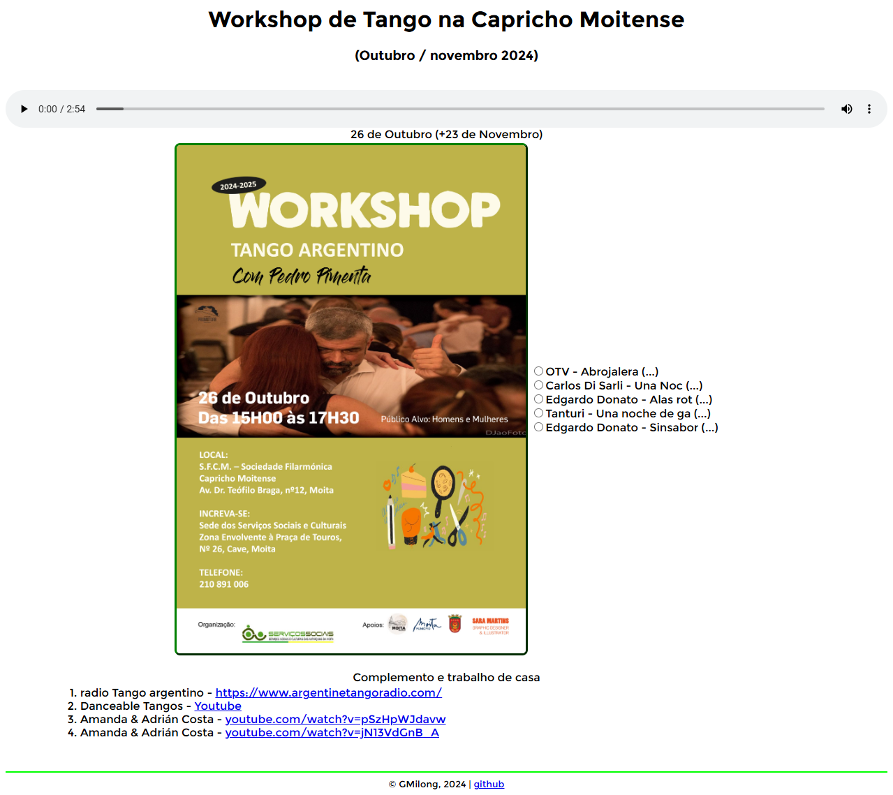
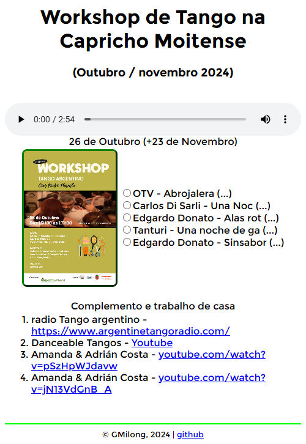

# Workshop de Tango @ Capricho Moitense

1. Contents' setup 🕖

2. pasta mp3
Esta pasta - [mp3](./mp3) - contém uma selecção de tangos 'pa escuchar y pa bailar'

3. a página [index.html](index.html), cada vez que carrega, selecciona aleatóriamente um subconjunto das faixas disponíveis.

4. a página [index.html](index.html) redimensiona os conteúdos em função da largura do ecrã (janela do browser):

| modo paisagem   | modo retrato  |
|----------|--------|
|     |  |

... y siga el Tango!
